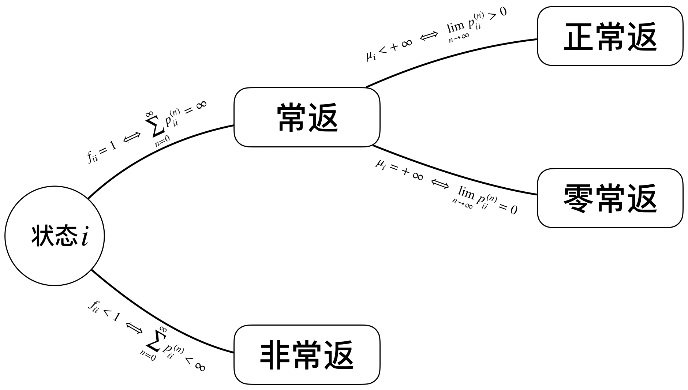

# 第四章 马尔可夫过程
## 离散时间参数马尔可夫链
### 定义
-  如果MC的转移概率满足$P \big(X(m+k)=j ~|~ X(m)=i \big) = P \big(X(k)=j ~|~ X(0)=i \big)  = p_{ij}^{(k)}$, 即不依赖于时间参数$m$, 则称该MC为**(时间)齐次MC**. (回忆泊松过程中关于时间齐次性的定义)
- **定理**(C-K方程) 对任意的$k, l=1,2,...$, 有 $$p_{ij}^{(k+l)} = \sum_{r \in E} p_{ir}^{(k)}p_{rj}^{(l)}, ~~ \forall i,j \in E$$
- **推论**
  - $P^{(k+l)} = P^{(k)}P^{(l)}$
  - $P^{(n)} = P^{(n-1)}P = \cdots = P^n$, 其中$P := P^{(1)}$为1步转移矩阵
  - $\pi^{(n)} = \pi^{(0)}P^{(n)}$, 其中$\pi^{(0)}$为初始分布

- 注记
  - 在时齐MC中, 只需初始分布$\pi^{(0)}$和1步转移矩阵$P$就可以完整刻画这个MC

### 状态的分类及性质
- **定义**: 如果存在$n\geq0$, 使得$p_{ij}^{(n)} > 0$, 则称$i$**可达**$j$,  记为$i \rightarrow j$. 否则, 称$i$不可达$j$,  记为$i \nrightarrow j$.
- **定义**: 如果$i \rightarrow j$且$j \rightarrow i$, 则称$i$和$j$**互通**, 记为$i \leftrightarrow j$.
- **定理**: 互通关系具有以下性质
  - 自反性: $i \leftrightarrow i$
  - 对称性: 若$i \leftrightarrow j$. 则$j \leftrightarrow i$
  - 传递性: 若$i \leftrightarrow k$且$k \leftrightarrow i$, 则$i \leftrightarrow j$
- **定义**: 从$i$出发经过$n$步首次到达$j$的概率 $$ f_{ij}^{(n)} = P(X_n=j, X_m \neq j, \forall 1 \leq m \leq n-1 | X_0=i) $$
	规定$f_{ij}^{(0)}=0$
- **定义**: 从$i$出发迟早到达$j$的概率 $$ f_{ij} = \sum_{n=1}^{+\infty} f_{ij}^{(n)} $$
- **性质**: $p_{ij}^{(n)} = \sum_{l=1}^n f_{ij}^{(l)}p_{jj}^{(n-l)} $
- **定义**: 如果$f_{ii}=1$, 则称$i$为**常返状态**, 否则称为**非常返状态**
- **定义**: 如果$i$为常返状态, 定义$i$的**平均返回时间**为$\mu_i := \sum_{n=1}^{\infty} nf_{ii}^{(n)}$. 若$\mu_i < \infty$, 则称$i$为**正常返状态**, 否则称为**零常返状态**
- **定义**: 如果$\{n: p_{ii}^{(n)}\}$的最大公约数为$t$, 则称$i$的**周期**为$t$,  如果$t=1$, 称状态$i$是**非周期**的.
- **定理**: $f_{ii} = 1 \iff \sum_{n=0}^\infty p_{ii}^{(n)} = \infty$
<!--待证明-->
- **定理**: 假设$i$为常返状态, 则$i$为零常返状态 $\iff \lim\limits_{n\rightarrow\infty} p_{ii}^{(n)} = 0$; 如果$i$时周期为$t$的正常返状态, 则$\lim\limits_{n\rightarrow\infty} p_{ii}^{(nt)} = \frac{t}{\mu_i}$
- **性质**: 若$i \leftrightarrow j$, 则$i, j$状态相同, 周期相同
- 例子: 一维直线上的无限制随机游走

- 注记
  - $f_{ij}^{(0)} = 0, p_{ii}^{(0)} = 1$
  - 当$i$为常返态时, 从$i$出发, 经过无穷多步, 访问$i$平均的平均次数也为无穷多次

### 状态空间的分解
- **定义**: 称$E$的子集$C$为**闭集**, 如果对任意的$i \in C, j \notin C$, 有$p_{ij}=0$, 即$\sum_{j \in C} p_{ij} = 1, \forall i \in C$, 如果$E$不含真的闭子集, 则MC称为**不可约**的.
- **定理**: 已知$i$为常返状态, 若$i \rightarrow j$, 则$j$也为常返态, 且$f_{ji}=1$, 从而$i \leftrightarrow j$

### 极限分布与平稳分布

## 连续时间参数马尔可夫链