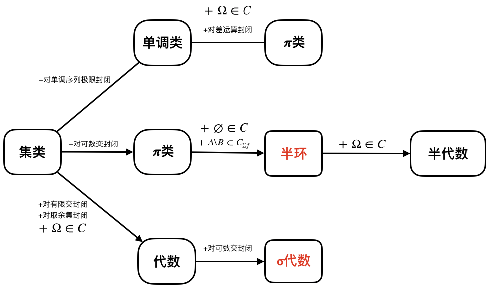

# 第一章 集类与测度
## 1.1 集合运算与集类
- $\Omega$: 给定的非空集合(全空间)
- **集类**: 以$\Omega$的某些子集为元素的集合称为($\Omega$上的)集类
- **单调列**: 设$\{A_n, n\geq1\}$为一集合序列, 若$\forall n \geq 1$, 有$A_n \subset A_{n+1}$(相应地, $A_n \supset A_{n+1}$), 则称$(A_n)$**单调增**(相应地, **单调减**). 令$A=\cup_n A_n$或$A=\cap_n A_n$, 称 $A$为$(A_n)$的极限, 记为$A_n \uparrow A$或$A_n \downarrow A$
- **集合的极限**: 对一般的集列$(A_n)$, 令
  - **上极限**: $\lim\limits_{n\rightarrow\infty}\sup A_n = \overline{\lim}\limits_{n\rightarrow\infty} A_n = \cap_{n=1}^\infty \cup_{k=n}^\infty A_k$
  - **下极限**: $\lim\limits_{n\rightarrow\infty}\inf A_n = \underline{\lim}\limits_{n\rightarrow\infty} A_n = \cup_{n=1}^\infty \cap_{k=n}^\infty A_k$
  - 易证:  
$\overline{\lim}\limits_{n\rightarrow\infty} A_n = \{ \omega ~|~ \forall~ n\geq1, \exists~ k(n) \geq n, ~s.t.~ \omega \in A_{k(n)} \}$   
$\underline{\lim}\limits_{n\rightarrow\infty} A_n = \{ \omega ~|~ \exists~ n\geq1, \forall~ k \geq n, ~s.t.~ \omega \in A_k \}$  
$\underline{\lim}\limits_{n\rightarrow\infty} A_n \subset \overline{\lim}\limits_{n\rightarrow\infty} A_n$.  
上述关于集合极限的等价定义比原始定义更易理解.
  - 若 $\overline{\lim}\limits_{n\rightarrow\infty} A_n = \underline{\lim}\limits_{n\rightarrow\infty} A_n$, 则称集列$(A_n)$的极限存在, 用$\lim\limits_{n\rightarrow\infty}A_n$表示.
  - 例子: $A_1=\{0\}, A_2=\{2\}, A_n=\{(-1)^n\}~(n\geq3)$, 则$\overline{\lim}\limits_{n\rightarrow\infty} A_n = \{1, -1\}, \underline{\lim}\limits_{n\rightarrow\infty} A_n = \emptyset $
  - 例子: $A_1=\{1\}, A_2=[2,3], A_n=[-1, \frac{1}{n}]~(n\geq3)$, 则$\overline{\lim}\limits_{n\rightarrow\infty} A_n = [-1,0], \underline{\lim}\limits_{n\rightarrow\infty} A_n = [-1,0] $
- 集合的划分
  - 若$(A_n)$两两不相交(即$A_m \cap A_n = \emptyset, \forall m \neq n$), 则常用$\sum_n A_n$表示$\cup_n A_n$
  - 若$\sum_n A_n=\Omega$, 则称$(A_n)$为$\Omega$的一个**划分**
  - 对任一集列$(A_n)$, 令$B_1=A_1, B_n = A_nA_{n-1}^c \cdots A_1^c~ (n\geq2)$, 可以证明$(B_n)$两两不相交, 且$\cup_n B_n = \cup_n A_n$ (*此处暂省去证明*)

- 令 $C_{\cap f} = \{ A | A = \cap_{i=1}^n A_i, A_i \in C, ~i=1, 2, ..., n,~ n \geq 1 \}$, 则
  - $C_{\cap f}$对有限交封闭
  - $C_{\cap f}$是包含$C$且对有限交封闭的最小集类
- 类似地, 可以定义: 
  - $C_{\cup f}$: 用有限并封闭$C$所得的集类
  - $C_{\Sigma f}$: 用有限不交并封闭$C$所得的集类
  - $C_{\delta}$: 用可列交封闭$C$所得的集类
  - $C_{\sigma}$: 用可列并封闭$C$所得的集类
  - $C_{\Sigma\sigma}$: 用可列不交并封闭$C$所得的集类

- **常用集类**
  - **$\pi$类**: 对有限交封闭
  - **半环**: $\emptyset \in C$, 对有限交封闭, $A, B \in C \Rightarrow A \backslash B \in C_{\Sigma f}$
  - **半代数**
  - **代数**(或**域**): $\Omega \in C, \emptyset \in C$, 对有限交封闭, 对取余集封闭 (由此推知,对有限并和差运算也封闭)
  - **$\sigma$代数**: $\Omega \in C, \emptyset \in C$, 对可列交封闭, 对取余集封闭 (由此推知,对可列并和差运算也封闭)
  - **单调类**: 对单调序列极限封闭
  - **$\lambda$类**: $\Omega \in C$, 对差运算封闭, 对单调增序列极限封闭(由此推知, 对取余集运算也封闭, 故$\emptyset \in C$)
  - 易证: $\sigma$代数为$\lambda$类, $\lambda$类为单调类

- 评论
  - 上这门课的目的, 是想对概率论有更深的认识. 第一节课下课问了下老师教学计划, 结果发现这门课可以改叫《测度论》了.
  - **集合**作为现代数学最基本的概念之一, 真是无处不在啊!
  - [这里](https://math.stackexchange.com/questions/476159/limits-of-sequences-of-sets)有一个关于集合极限很好的解释. 从直观上解释了我们为什么要引入集合的上下极限的概念?
  - **有限**的概念我们在日常生活中接触很多, 但**可数**的概念就需要引入极限, 从**有限**到**可数**是一个很大的跨度.

## 1.2 单调类定理
- 准备
  - 设$\{ C_i | i \in I \}$为$\Omega$上的**一族集类**, 若对每个集类$C_i$对某种运算封闭, 则$\cap_i C_i$也对这种运算封闭
  - 令$\sigma(C) = \cap_{g \supset C, g是\sigma代数}~~~g$. 易证: $\sigma(C)$是包含$C$的最小$\sigma$代数
  - 同理, 可以定义$m(c)$(包含$C$的最小单调类)和$\lambda(C)$(包含$C$的最小$\lambda$类)
  - 易证: 恒有$m(C) \subset \lambda(C) \subset \sigma(C)$

- 引理
  - 若$C$同时为代数和单调类, 则$C$为$\sigma$代数
  - 若$C$同时为$\lambda$类和$\pi$类, 则$C$为$\sigma$代数

<!--待证明-->
- **单调类定理**: 设$C$为一集类
  - 若$C$为代数, 则$m(C) = \sigma(C)$
  - 若$C$为$\pi$类, 则$\lambda(C) = \sigma(C)$

<!--待证明-->
- **定理**1.2.3: 设$C$为一集类
  - $m(C) = \sigma(C) \iff A \in C \Rightarrow A^c \in m(C);~ A, B \in C \Rightarrow A \cap B \in m(C)$
  - $\lambda(C) = \sigma(C) \iff A, B \in C \Rightarrow A \cap B \in \lambda(C) $

<!--待证明-->
- **定理**1.2.5: 设$C$为一集类, 若它满足下列条件之一, 则有$m(C) = \sigma(C)$:
  - $A, B, \in C \Rightarrow A \cap B \in C;~ A \in C \Rightarrow A^c \in C_\delta$
  - $A, B, \in C \Rightarrow A \cup B \in C;~ A \in C \Rightarrow A^c \in C_\sigma$

- 例: 用$F$表示$\Re$中闭集全体, 用$G$表示$\Re$中开集全体, 有
  - $\sigma(F) = \sigma(G)$ (通常记作$B(\Re)$, $\Re$中的Borel $\sigma$代数)
  - $m(G) = \sigma(G)$

## 1.3 测度与非负集函数
- 在本节中我们会
  - 定义**非负集函数**及其性质
  - 定义**可测空间**, **测度**, **测度空间**
  - 了解到测度本质上是一个定义在$\sigma$代数上的非负函数, 且具有单调性, 可减性, 从上连续, 从下连续<!--, 在空集中连续-->的性质

- 定义
  - 设$C$为任一包含$\emptyset$集类, 称$\mu: C \rightarrow \overline{\Re}_+$为$C$上的**非负集函数**. 
  - 在下述定义中约定: (1) $\mu(\emptyset) = 0$ (2) $\mu$满足单调性: $A, B \in C,~ A \subset B \Rightarrow \mu(A) \leq \mu(B)$
  - **有限可加性**: $A_i \in C ~(i \in [n]),~ \Sigma_{i=1}^n A_i \in C \Rightarrow \mu(\Sigma_{i=1}^n A_i) = \Sigma_{i=1}^n \mu(A_i) $
  - **$\sigma$可加性**: $A_i \in C ~(i \geq 1),~ \Sigma_{i=1}^\infty A_i \in C \Rightarrow \mu(\Sigma_{i=1}^\infty A_i) = \Sigma_{i=1}^\infty \mu(A_i) $
  - **半$\sigma$可加性**: $A \in C, A_i \in C ~(i \geq 1), A \subset  \cup_{i=1}^\infty A_i \Rightarrow \mu(A) \leq \Sigma_{i=1}^\infty \mu(A_i) $
  - **从下连续**: $A_n \in C, A_n \uparrow A, A \in C \Rightarrow \lim\limits_{n \rightarrow \infty} \mu(A_n) = \mu(A)$
  - **从上连续**: $A_n \in C, A_n \downarrow A, A \in C \Rightarrow \lim\limits_{n \rightarrow \infty} \mu(A_n) = \mu(A)$
  -  **在空集中连续**: $A_n \in C, A_n \downarrow \emptyset \Rightarrow \lim\limits_{n \rightarrow \infty} \mu(A_n) = \mu(\emptyset) = 0$
  -  显然: 从上连续 $\Rightarrow$ 在空集中连续

- 定义
  - 我们称$(\Omega, F)$为**可测空间**如果$F$是$\Omega$上的$\sigma$代数
  - 我们称$\mu: F \rightarrow \overline{\Re}_+ = [0, +\infty]$为$(\Omega, F)$上的**测度**, 如果(1)$\mu(\emptyset)=0$ (2)$\mu$满足**可列可加性**或**$\sigma$可加性**
  - 设$\mu$为可测空间$(\Omega, F)$上的测度, 则称$(\Omega, F, \mu)$为**测度空间**
  - 若$\mu(\Omega)<\infty$, 则称$\mu$为**有限测度**; 若$\mu(\Omega)=1$, 则称$\mu$为**概率测度**; 若存在$A_n \in F, n \geq 1$, 使得$\cup_n A_n = \Omega$, 且$\mu(A_n) < \infty, \forall n$, 则称$\mu$为**$\sigma$有限测度**
  - 例子: $(\Re, B(\Re), \lambda)$, 其中$B(\Re)$为Borel $\sigma$代数, $\lambda$为*Lebsgue*测度, 
  - 有限测度($\mu(\Omega) < \infty$), 概率测度($\mu(\Omega)=1$), $\sigma$有限测度
  - 若$A \in F, \mu(A)=0$, 则称$A$是**$\mu$零测集**
  - 如果任何$\mu$零测集的子集都属于$F$, 则称$F$关于$\mu$是完备的, 称是$(\Omega, F, \mu)$**完备测度空间**

<!--待证明-->
- 定理: 设$(\Omega, F, \mu)$为一测度空间, 则$\mu$满足
  - 单调可减性: $A, B \in F, A \subset B, \mu(B) < \infty \Rightarrow \mu(B \backslash A) = \mu(B) - \mu(A)$
  - 从下连续, 从上连续

- 评论
  - 非负集函数的定义非常重要, 在后面的章节会反复遇到, 需牢记且理解.

## 1.4 外测度与测度的扩张
- 在本节中我们会
  - 研究如何把一半环$C$上的一个$\sigma$可加非负集函数扩张称为$\sigma$代数$\sigma(C)$上的测度
  - 定义**外测度**

- **定义**
 - 令$A(\Omega)$表示$\Omega$中所有子集(包含$\emptyset$)构成的集类
 - 设$\mu^*: A(\Omega) \rightarrow \overline{\Re}_+$为$A(\Omega)$上的一非负集函数, 我们称$\mu^*$为$\Omega$上的**外测度**, 如果(1)$A \subset B \subset \Omega \Rightarrow \mu^* (A) \leq \mu^* (B)$ (单调性) (2) $A_n \subset \Omega (n \geq 1) \Rightarrow \mu^* (\cup_{n=1}^\infty A_n) \leq \sum_{n=1}^\infty \mu^*(A_n) $ (次$\sigma$可加性)
 - 注意次$\sigma$可加性和半$\sigma$可加性区别. 半$\sigma$可加性是针对一般的集类, 而次$\sigma$可加性是定义在$A(\Omega)$上的.

<!--待证明-->
- **定理**: 设$\mu^*$为$\Omega$上的一外测度. 令 $$U = \{ A \subset \Omega | \forall D \subset \Omega, \mu^*(D) = \mu^*(A \cap D) + \mu^*(A^c \cap D) \}$$ 则$\mu^*$为$\Omega$上的一$\sigma$代数, 且$\mu^*$限于$U$为一测度. 我们称$U$中的元素为**$\mu^*$可测集**.

<!--待证明-->
- **命题**: 设$C$为$\Omega$上一集类, 且$\emptyset \in C$. 又设$\mu$为$C$上的一半$\sigma$可加非负集函数, 且$\mu(\emptyset)=0$. 令 $$ \mu^*(A) = \inf \Big\{ \sum_{n=1}^\infty \mu(A_n) | A_n \in C, A \subset \cup_{n=1}^\infty A_n \Big\}, A \subset \Omega $$ 则$\mu^*$为$\Omega$上的外测度, 且$\mu^*$限于$C$与$\mu$一致, 我们称$\mu^*$为由$\mu$**引出的外测度**.

<!--待证明-->
- **命题**(1.4.4): 设$\mu$为半环$C$上的一非负集函数(约定$\mu(\emptyset)=0$). 则$\mu$是$\sigma$可加的 $\iff$ $\mu$为有限可加且半$\sigma$可加的

<!--待证明-->
- **引理**(1.4.5): 设$C$为$\Omega$上的一集类, 且$\emptyset \in C$. 又设$\mu$为$C$上的一半$\sigma$可加非负集函数, 且$\mu(\emptyset = 0)$, $\mu^*$为$\mu$引出的外测度. 则 $A$为$\mu^*$可测集 $\iff$ $\forall B \in C$, 有 $ \mu(B) \geq \mu^*(B \cap A) + \mu^*(B \cap A^c) $

- **引理**(1.4.6):

<!--待证明-->
- **Caratheodory测度扩张定理**: 设$C$为$\Omega$上的一半环, $\mu$为$C$上的一$\sigma$可加非负集函数, 则$\mu$可扩张成$\sigma(C)$上的一测度. 若进一步$\mu$在$C$上为$\sigma$有限,  且$\Omega \in C_\sigma$, 则这一扩张是唯一的, 并且扩张所得的测度在$\sigma(C)$上也是$\sigma$有限的. 

## 1.5 $\Re^n$中的Lebesgue-Stieltjes测度
- 在本节中, 我们将
  - 先在$\Re^n$中, 建立Lebesgue测度
  - 然后在$\Re^n$中, 在Lebesgue测度的基础上, 建立更一般的Lebesgue-Stieltjes测度

- 设$a=(a_1, ..., a_n), b=(b_1, ..., b_n) \in \Re^n$. 先做以下约定: 
  -  记$a \leq b$, 如果$a_i \leq b_i, \forall i \in [n]$. ($a < b$类似)
  -  令$C = \{ (a,b] | a \leq b, a,b \in \Re^n \}$
  -  令$\mu\big( (a, b] \big) = \Pi_{i=1}^n (b_i-a_i)$

- **引理**(1.5.1): $C$是$\Re^n$上的半环, $\mu$是$C$上的$\sigma$可加非负集函数. 
- **定理**(1.5.2): 易证$\sigma(C) = B(\Re^n)$. 根据测度扩张定理, 可以将$\mu$唯一地扩张成为$B(\Re)$上的$\sigma$有限测度, 称之为**Lebesgue测度**
- **定义**(1.5.3)
  - 增函数
  - 设$\mu$为$B(\Re^n)$上一$\sigma$有限测度, 则称$\mu$为**Lebesgue-Stieltjes测度**
- **定理**(1.5.4): 