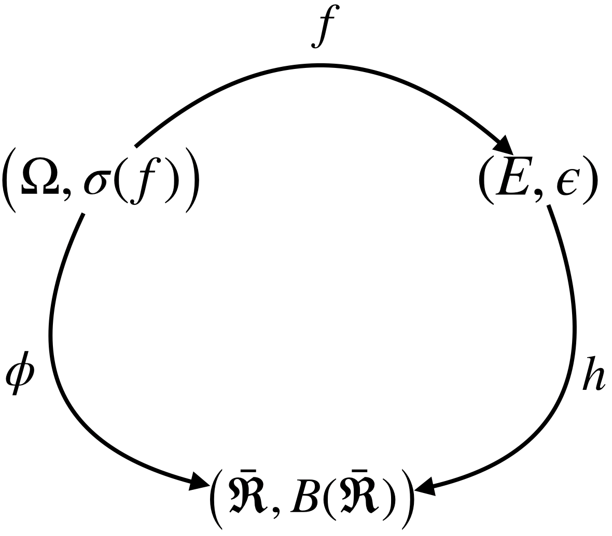

# 第二章 可测映射
## 2.1 定义及基本性质
- 在本节中, 我们将会
  - 定义可测映射, 可测函数
  - 给出判断一个数值函数是否可测的方法
  - 给出可测函数的性质
  - 定义示性函数和简单函数, 并用简单函数逼近任一可测函数

- 定义
  - 设$(\Omega, F)$和$(E, \mathscr{E})$是两个可测空间. $f: \Omega \rightarrow E$, 如果对一切$A \in \mathscr{E}$有$f^{-1}(A) \in F$, 则称$f$为F可测映射. 记$f^{-1}(\mathscr{E}) = \{ f^{-1}(A) | A\in\mathscr{E} \}$. 则$f$为F可测映射 $\iff$ $f^{-1}(\mathscr{E}) \subset F$
  - 令$\bar{\Re} = \Re \cup \{-\infty, +\infty\}$. $B(\bar{\Re})$为$\bar{\Re}$上的Borel $\sigma$代数.
  - 令$(\Omega, F)$为一可测空间. $f: \Omega \rightarrow \bar{\Re}$, 若$f^{-1}(\bar{\Re}) \subset F$, 则称f为**数值可测函数**, 或**Borel可测函数**, 简称**可测函数**. $f: \Omega \rightarrow \bar{\Re}$, 若$f^{-1}(\Re) \subset F$, 则称f为**实值可测函数**

<!--IMPORTANT-->
- **命题**: 设$(\Omega, \mathscr{F})$和$(E, \mathscr{E})$是两个可测空间, $C \subset \mathscr{E}$, 满足$\sigma(C) = \mathscr{E}$. 若$f^{-1}(C) \subset F$, 则f可测.

<!--IMPORTANT-->
- **定理**2.1.4 设$f$是$(\Omega, \mathscr{F})$上的一个数值函数, $[f < a] := \{ \omega \in \Omega | f(\omega) < a \}$, 则下列条件等价:
 - $f$可测
 - $\forall a \in \Re, [f < a] \in \mathscr{F}$
 - $\forall a \in \Re, [f > a] \in \mathscr{F}$
 - $\forall a \in \Re, [f \leq a] \in \mathscr{F}$
 - $\forall a \in \Re, [f \geq a] \in \mathscr{F}$

<!--IMPORTANT-->
- **命题**2.1.5 $(\Omega, \mathscr{F})$上实值可测全体构成实数域上的向量空间, 即$\forall a \in \Re$, 若$f, g$可测, 则有
  - $a\cdot f$可测
  - $f+g$可测

<!--IMPORTANT-->
- **命题**2.1.6 设$f, g, \{f_n\}_{n\geq1}$都是$(\Omega, \mathscr{F})$上的(数值)可测函数, 则
  - $f \cdot g$可测
  - $f+g$可测
  - $\frac{f}{g}$可测
  - $\inf\limits_{n\geq1} f_n ,~ \sup\limits_{n\geq1} f_n ,~ \sup\limits_{n\geq1}\inf\limits_{k\geq n} f_k ,~ \inf\limits_{n\geq1}\sup\limits_{k\geq n} f_k$可测
  - $[f=g],~ [f \leq g]$为可测集

- **定义** 2.1.7
  - **示性函数**: 给定$A \subset \Omega$, 令$1_{A}(\omega) = \begin{cases}1, & \omega \in A \\ 0, & \omega \notin A\end{cases}$, 称为$1_{A}$为示性函数. 若$A \in \mathscr{F}$, 则$1_{A}$可测.
  - **简单函数**: 若$f$只取有限多个值, 则称$f$为简单函数. 设$f$为一简单函数, 其值域为$\{a_1, ..., a_n\}$. 令$A_i = [f=a_i] = f^{-1}(\{a_i\}), i=1, ..., n$, 则$f=\sum_{i=1}^n a_i 1_{A_i}$. $f$可测当且仅当$A_i \in \mathscr{F}, i=1,...,n$ 

<!--IMPORTANT-->
- **定理** 2.1.8 设$(\Omega, \mathscr{F})$为一可测空间, $f$为一(数值)可测函数.
  - 存在可测简单函数序列$\{f_n\}_{n\geq 1}$, 使得$\forall n \geq 1, |f_n| \leq |f|$, 且$\lim_\limits{n \rightarrow \infty} f_n = f, \forall \omega \in \Omega$
  - 若$f$非负, 则存在可测简单函数序列$\{f_n\}_{n\geq 1}$, 使得 $f_n \uparrow f$

- **定义** 2.1.10 设$(E, \mathscr{E})$为一可测空间, $\mathscr{H}$为一族$\Omega$到$E$的映射构成的集合, 令$\mathscr{G} = \sigma\big( \cup_{f\in\mathscr{F}}f^{-1}(\mathscr{E}) \big)$, 则$\mathscr{G}$为使$\mathscr{H}$中所有元素可测的最小$\sigma$代数, 称$\mathscr{G}$为$\mathscr{H}$在$\Omega$上生成的$\sigma$代数. 特别的, 当$\mathscr{H} = \{f\}$, 则$\mathscr{G} = f^{-1}(\mathscr{E})$, 通常记作$\sigma(f)$.

<!--未证明-->
- **定理** 2.1.11 设$f: \Omega \rightarrow (E, \mathscr{E})$为一映射, $\sigma(f) = f^{-1}(\mathscr{E})$, 则数值函数$\phi: (\Omega, \sigma(f)) \rightarrow (\bar{\Re}, B(\bar{\Re}))$可测 $\iff$ 存在$(E, \mathscr{E})$上的可测函数$h$, 使得$\phi = h \circ f$

- 注记
  - 可测映射是对两个任意抽象可测空间, 而(数值/Borel)可测函数则必须是映射到数值可测空间$\big(\bar{\Re}, B(\bar{\Re}) \big)$上.

## 2.2 单调类定理(函数形式)
<!--未证明-->
- **定理** 2.2.1 设$C$为$\Omega$上一$\pi$类, $\mathscr{H}$为$\Omega$上的一些实值函数构成的线形空间. 如果他们满足下列条件:
  - $1 \in \mathscr{H}$
  - $f_n \in \mathscr{H} (n \geq 1), 0 \leq f_n \uparrow f$且$f$有限, 则$f \in \mathscr{H}$
  - $\forall A \in C, 1_A \in \mathscr{H}$

  则$\mathscr{H}$包含$\Omega$上的所有$\sigma(C)$可测实值函数.

## 2.3 可测函数序列的几种收敛形式
- 在本节中, 我们将会
  - 定义可测函数序列的几种收敛形式
  - 给出这几种收敛形式的等价表达
  - 给出这几种收敛形式之间的关系

- **定义** 2.3.1 设$\{f_n\}_{n\geq1}, f$均为$(\Omega, \mathscr{F}, \mu)$上的实值可测函数
  - 如果存在一零测集$N \in \mathscr{F}, \mu(F)=0$, 使得$\lim\limits_{n \rightarrow \infty} f_n(\omega) = f(\omega), \forall \omega \in N^c$, 则称$\{f_n\}_{n\geq1}$**几乎处处收敛于**$f$, 记作$f \xrightarrow{a.e.} f$或$\lim\limits_{n \rightarrow \infty} f_n = f ~~a.e.$
  - 若对$\forall \epsilon, \lim\limits_{n \rightarrow \infty} \mu\Big(\big[|f_n-f|>\epsilon \big]\Big)=0$, 则称$\{f_n\}_{n\geq1}$**依测度收敛到**$f$, 记作$f \xrightarrow{\mu} f$
  - 如果对$\forall \epsilon > 0, \exists A \in \mathscr{F} ~s.t.~ \mu(A) < \epsilon$, 且$\lim\limits_{n \rightarrow \infty} \sup\limits_{\omega \in A^c} |f_n(\omega)-f(\omega)| =0$, 则称$f_n$**几乎一致收敛**到$f$, 记作$f_n \xrightarrow{a.un.} f$或$\lim\limits_{n \rightarrow \infty} f_n = f ~~a.un.$

<!--(2)(3)待证明-->
- **定理** 2.3.4 设$\{f_n\}$和$f$均为实值可测函数
  - $f_n \xrightarrow{a.e.} f \iff \forall \epsilon > 0$, 有 $\mu\Big( \cap_{n=1}^\infty \cup_{i=n}^\infty \big[|f_i-f|\geq\epsilon\big] \Big) = 0$
  - $f_n \xrightarrow{a.un.} f \iff \forall \epsilon > 0$, 有 $\lim\limits_{n\rightarrow\infty} \mu\Big(\cup_{i=n}^\infty \big[|f_i-f|\geq\epsilon\big] \Big) = 0$
  - $f_n \xrightarrow{\mu} f \iff $ 对$\{f_n\}$的任意子列$\{f_{n'}\}$, 存在其子列$\{f_{n_k'}\}$, 使得$f_{n_k'} \xrightarrow{a.un.} f, (k \rightarrow \infty)$.

<!--(3)待证明-->
- **定理** 2.3.5 
  - $f_n \xrightarrow{a.un.} f  \Rightarrow f_n \xrightarrow{a.e.} f$; $f_n \xrightarrow{a.un.} f  \Rightarrow f_n \xrightarrow{\mu} f$
  - 若$\mu$为有限测度, 则有$f_n \xrightarrow{a.un.} f  \iff f_n \xrightarrow{a.e.} f$
  - 若$f_n \xrightarrow{\mu} f$, 则存在子列$\{f_{n_k}\}$, 使得$f_{n_k} \xrightarrow{a.e.} f$

- 注记
  - 三种收敛形式都是定义在测度空间上
  - 定理2.3.4用集合语言将三种收敛重新描述了一遍
  - 回忆数学分析中函数序列$\{f_n\}_{n\geq1}$的**点点收敛**和**一致收敛**的定义, 一致收敛是比点点收敛更强的收敛形式
  - 定理2.3.5(2)中$\Leftarrow$部分称为**Egorov定理**
  - 由于概率测度空间为一有限测度空间, 所以几乎处处收敛于和几乎一致收敛等价.

