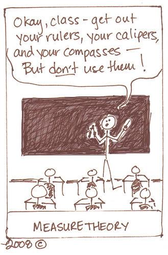

- 课程名称: 测度与概率论
- 教材: 《测度论讲义》(第二版) 严加安著
- 简介: 在实变函数中我们在欧氏空间$\Re^d$中定义了Borel $\sigma$代数上的Lebsgue测度, 在测度论中我们将在更一般的抽象空间上定义和研究测度. 这么做是必要的且有意义的, 因为以测度论为基础, 我们可以将概率公理化. 
<!--要知道, 在Kolmogorov创立概率论公理化体系之前-->

